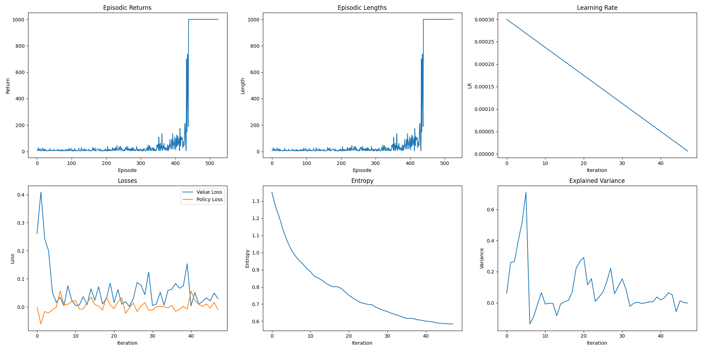

Does GDP/belief net serve as a forward model, similar to the Cerebellum function, to facilitate motor action execution by providing a motor plan derived from previous motor control experiences for additional guidance (than just sensory feedback)? Moreover, can this new motor learning process be incorporated into the GDP for future motor controls?

<video width="600" controls>
  <source src="demo.mp4" type="video/mp4">
  Your browser does not support the video tag.
</video>

