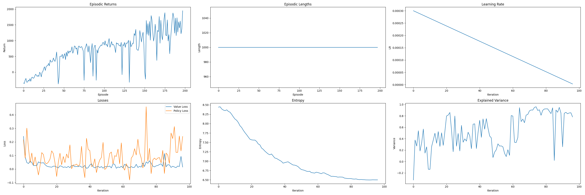
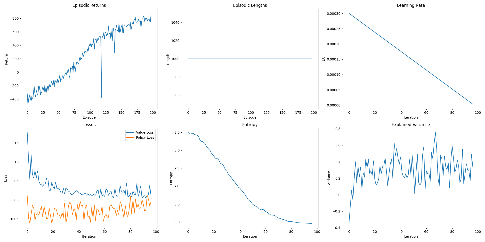

Does UNP Belief network serve as a forward model, similar to the Cerebellum function, to facilitate motor action execution by providing a motor plan derived from previous motor control experiences for additional guidance (than just sensory feedback)? Moreover, can this new motor learning process be incorporated into the GDP for future motor controls?

## FMPPO Control Examples

### Retrained PPO & Fm-PPO Agents on Half-Cheetah Task

          

            <video controls autoplay style="width: 100%; height: auto;" muted>
              <source src="../assets/fmppo_demo1.mp4" type="video/mp4">
              Your browser does not support the video tag.
            </video>
            <blockquote>Deep-RL Inverted Pendulum agent trained using Fm-PPO</blockquote>
          

          

            <video controls autoplay style="width: 100%; height: auto;" muted>
              <source src="../assets/fmppo_demo2.mp4" type="video/mp4">
              Your browser does not support the video tag.
            </video>
            <blockquote>Deep-RL Half Cheetah agent trained using Fm-PPO</blockquote>
          

        

