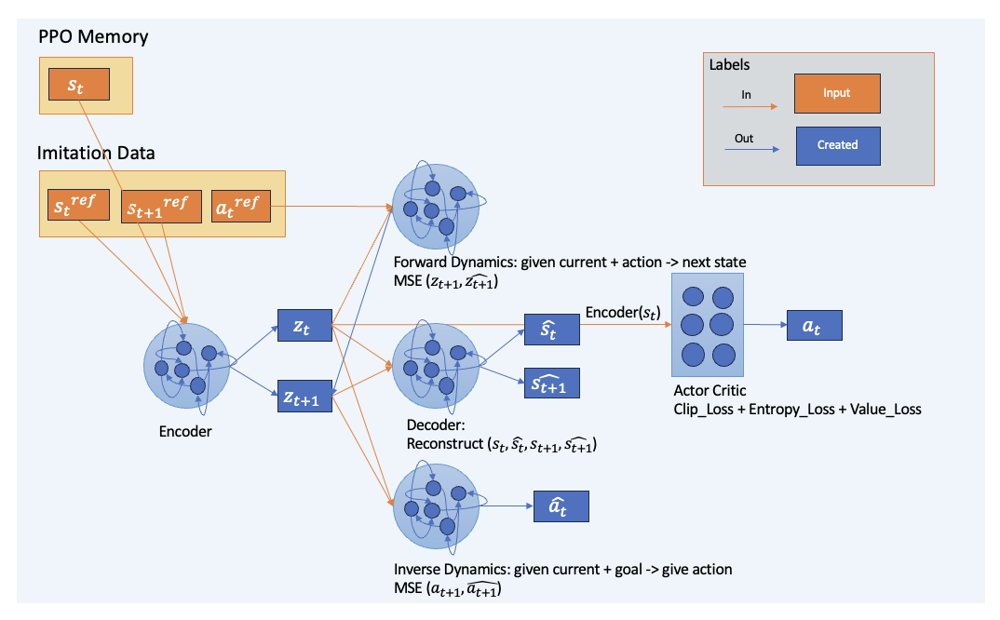
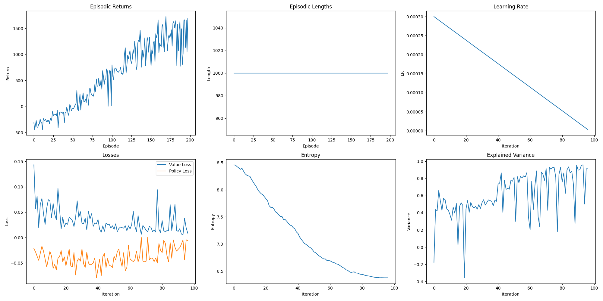
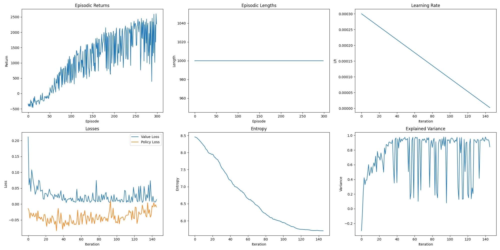
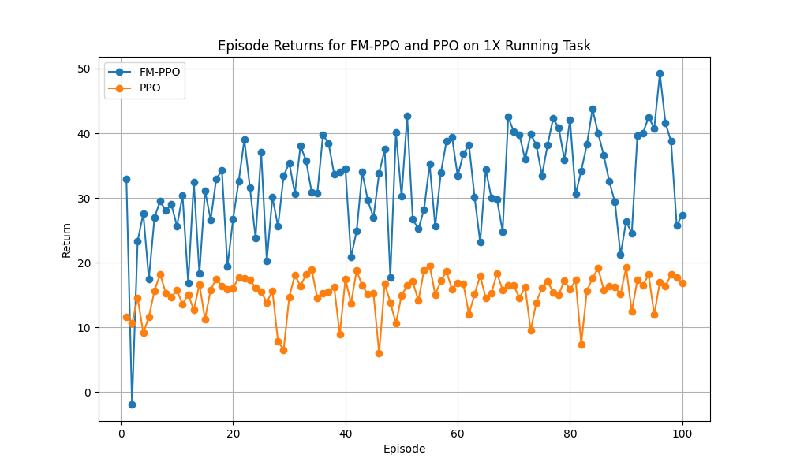
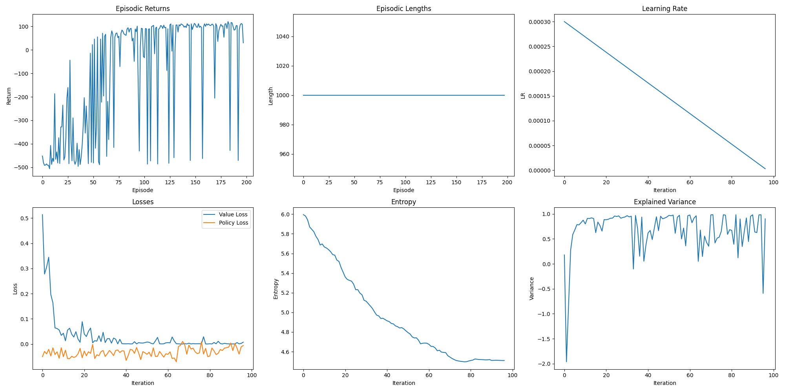
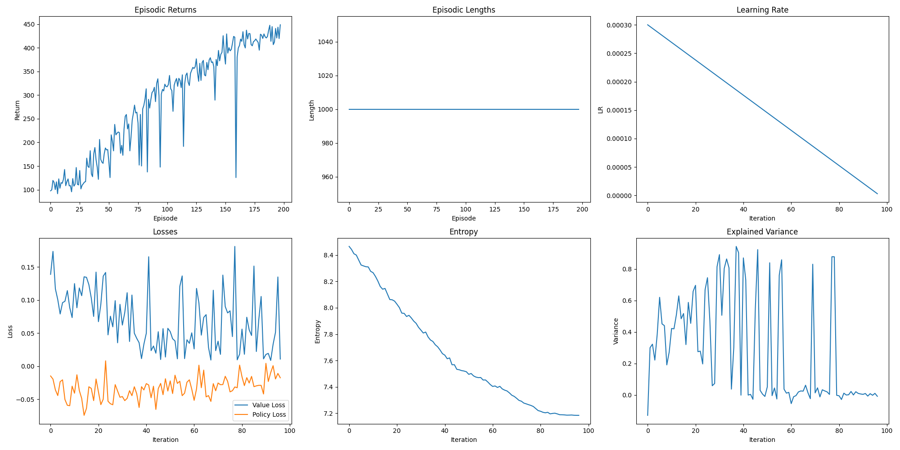
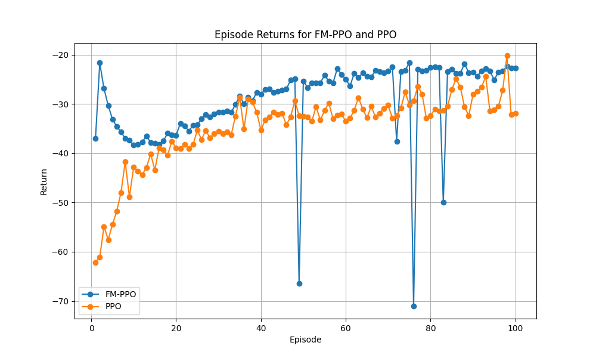
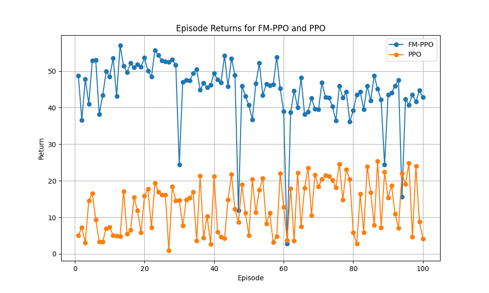

Does UNP Belief network serve as a forward model, similar to the Cerebellum function, to facilitate motor action execution by providing a motor plan derived from previous motor control experiences for additional guidance (than just sensory feedback)? Moreover, can this new motor learning process be incorporated into the GDP for future motor controls?

## FMPPO Control Examples

### Retrained PPO & Fm-PPO Agents on Half-Cheetah Task
All Fm-PPO should start tarining from scratch, with the goal to try to observe how the Fm-Core help the agent to get higher rewards.

PPO trained on 2e5 global steps:

Fm-PPO trained on 2e5 global steps with transfered Fm-core and imitation data:

Transfer Twice Core:

Transfer Three Times Core:

PPO and Fm-PPO Agent post-training evaluation on new random environment for same running task as training:

### Transfer Learning

PPO trained on 2e5 global steps:

Fm-PPO trained on 2e5 global steps with transfered Fm-core and imitation data:

PPO and Fm-PPO Agent post-training evaluation on new random environment for jump task:

PPO and Fm-PPO Agent post-training evaluation on new random environment for 2x running task:

          

            <video controls autoplay style="width: 100%; height: auto;" muted>
              <source src="../assets/fmppo_demo1.mp4" type="video/mp4">
              Your browser does not support the video tag.
            </video>
            <blockquote>Deep-RL Inverted Pendulum agent trained using Fm-PPO</blockquote>
          

          

            <video controls autoplay style="width: 100%; height: auto;" muted>
              <source src="../assets/fmppo_demo2.mp4" type="video/mp4">
              Your browser does not support the video tag.
            </video>
            <blockquote>Deep-RL Half Cheetah agent trained using Fm-PPO</blockquote>
          

        
