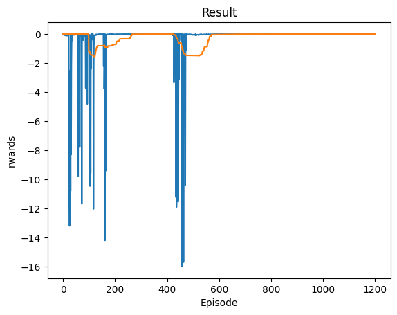

# Continual Learning Environment
Testing for Continual Learning algorithms using simple OpenAI Gym Cartpool/Pendulum Environment
(Currently trying to use AGOP and RFM in training)

## Deep Q Network Training on Pendulum Control

DQN Continuous + Pendulum Control

    

DQN Discrete + Pendulum Control

    

DQN Discrete Retrained + Pendulum Control

    

## Demos of Trained Results

Pendulum Random Control

    <video controls style="width: 50%; height: auto;">
        <source src="demos/demo_1.mp4" type="video/mp4">
        Your browser does not support the video tag.
    </video>

Pendulum Discrete Retrained DQN Control

    <video controls style="width: 50%; height: auto;">
        <source src="demos/demo_2.mp4" type="video/mp4">
        Your browser does not support the video tag.
    </video>

