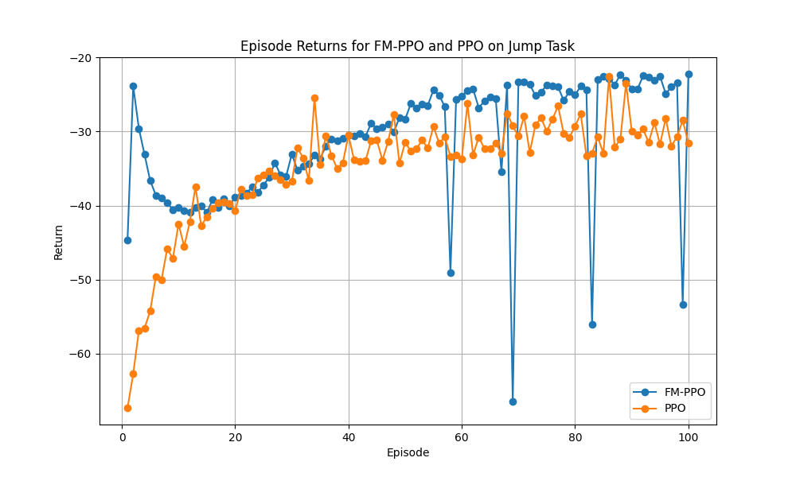
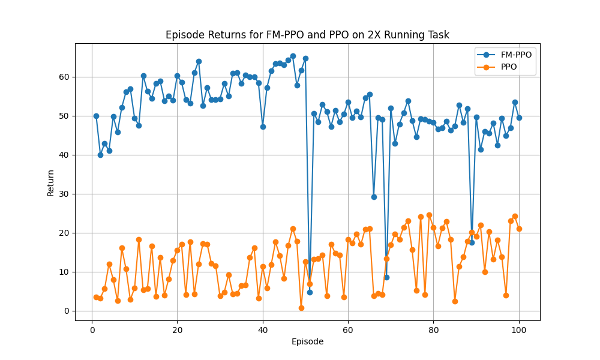

## Research Question & Progress

### Context:
The cerebellum have been long theorized to play an crucial rule in motor control and learning (Forward modeling). Corollary discharge encodes a efferent copy of the motor command to be processed to predict the consequences of actions before sensory feedback is available. Such process would help us predicts how the sensory state of our body will change and how should these actions be performed, achieving better performances in control.

Using examples from (Albert and Shadmehr, 2018), with the starting and ending positions in hand, the parietal regions of your cerebral cortex compute the path of the arm that connects these positions in space the trajectory of the movement. After the trajectory is determined, your primary motor cortex and other associated pre-motor areas then carefully transform this sensory signal into a motor plan, namely the patterns of muscle contraction that will move your arm along the desired path towards the coffee.

### Questions:
Does establishing a Forward Model, similar to the Cerebellum's function, facilitate motor action execution by providing a motor plan derived from previous motor control experiences for additional guidance (compare to pure sensory feedback like in model-free RL)? Moreover, can this new motor learning process be incorporated into the GDP for future motor controls?

- Objective 1: See if such biologically inspired strategy (for example, maybe using mechanistic insight, maybe using neuronal representation as inductive biases) improves performance;
- Objective 2: See if the Forward Model would resemble functionality and behavior of the cerebellum (for example, showing gradual learning of new motor skills).
  - Idealy using a more biological realistic model with more biological realistic task such as the rodent model in VNL.

### Current Progress:
1. Fm-Core transfer significantly improves same task training and testing performance (by same task, it means that the pre-trained Fm-core and Fm-PPO is trained in the same nevironmental setup).
2. Fm-Core supports forward transfer learning (plasticity) and shows both training performance improvement and generalization performance during evaluation time.
  - When we find a good core, really good starting ground and add on domain specific experience.
  - Concerns with overfitting.
  - Still on-going testing on checking backward transfer (memory stability)
3. Latent representation analysis on-going.

## FMPPO Control Examples

          

            <video controls autoplay style="width: 100%; height: auto;" muted>
              <source src="../assets/fmppo_demo1.mp4" type="video/mp4">
              Your browser does not support the video tag.
            </video>
            <blockquote>Deep-RL Inverted Pendulum agent trained using Fm-PPO</blockquote>
          

          

            <video controls autoplay style="width: 100%; height: auto;" muted>
              <source src="../assets/fmppo_demo2.mp4" type="video/mp4">
              Your browser does not support the video tag.
            </video>
            <blockquote>Deep-RL Half Cheetah agent trained using Fm-PPO</blockquote>
          

        

### Retrained PPO & Fm-PPO Agents on Half-Cheetah Task
All Fm-PPO should start tarining from scratch, with the goal to try to observe how the Fm-Core help the agent to get higher rewards.

PPO trained on 2e5 global steps:

Fm-PPO trained on 2e5 global steps with transfered Fm-core and imitation data:

Transfer Twice Core:

Transfer Three Times Core:

PPO and Fm-PPO Agent post-training evaluation on new random environment for same running task as training:

  

### Transfer Learning (Plasticity)

PPO trained on 2e5 global steps:

Fm-PPO trained on 2e5 global steps with transfered Fm-core and imitation data:

PPO and Fm-PPO Agent post-training evaluation on new random environment for jump task:

  

PPO and Fm-PPO Agent post-training evaluation on new random environment for 2x running task:

  

PPO and Fm-PPO Agent post-training evaluation using 1X running task weights on jump task:

  

PPO and Fm-PPO Agent post-training evaluation using 1X running task weights on 2X running task:

  

### Transfer Learning (Memory Stability)

PPO and Fm-PPO Agent post-training evaluation using jump task weights on 1X running task:

  

### Latent Representations With PCA

PPO Latent Representation (Action distribution is latent), model action applied:

FMPPO Latent Representation (Z in encder is latent), model action applied:

Fm-Core Latent Representation (Z in encder is latent), random action applied in v1 task:

Fm-Core Latent Representation (Z in encder is latent), random action applied in v2 task:

Fm-Core Latent Representation (Z in encder is latent), random action applied in jump task:

